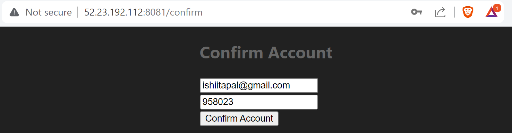
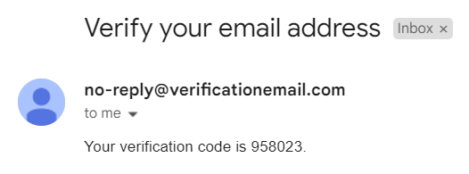
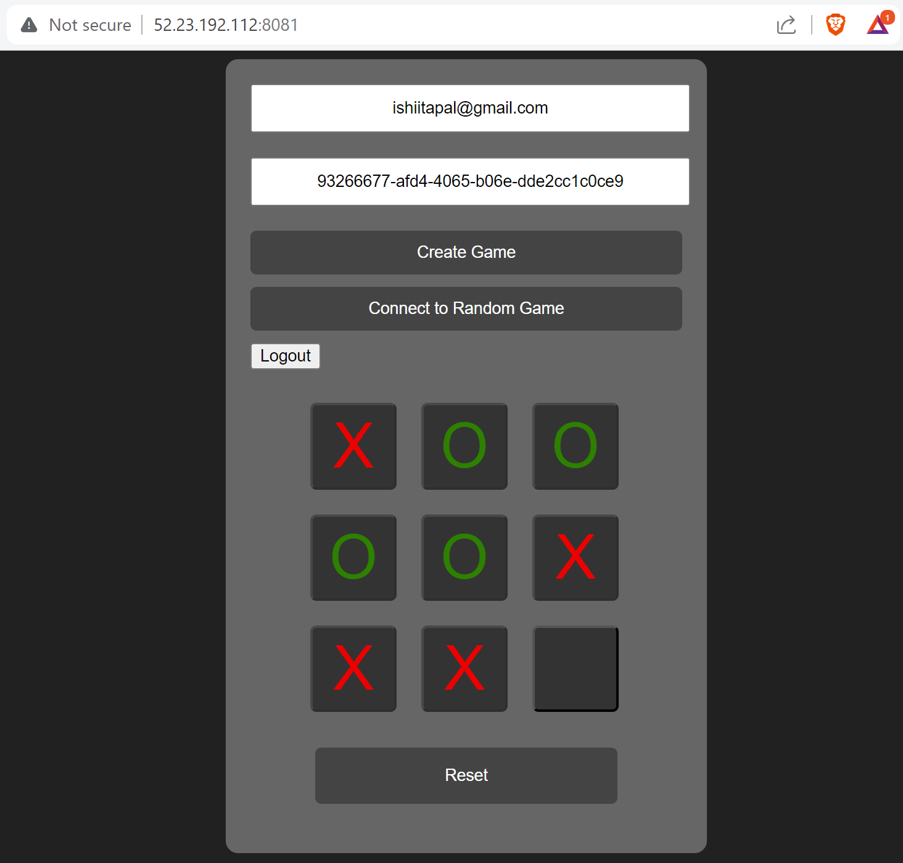
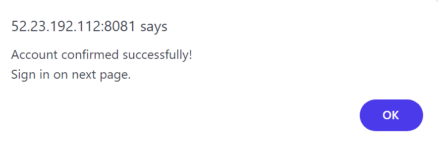
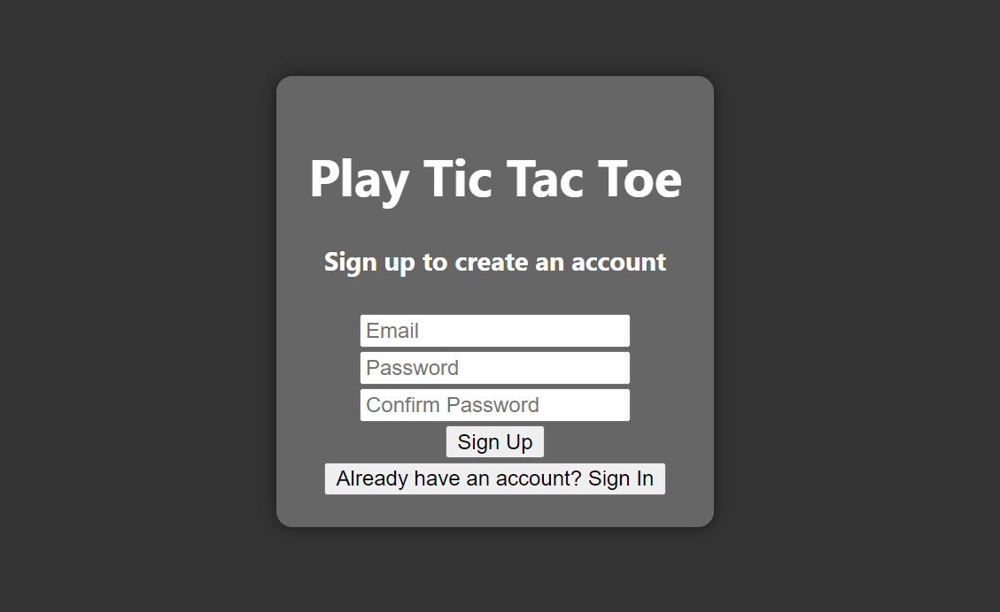
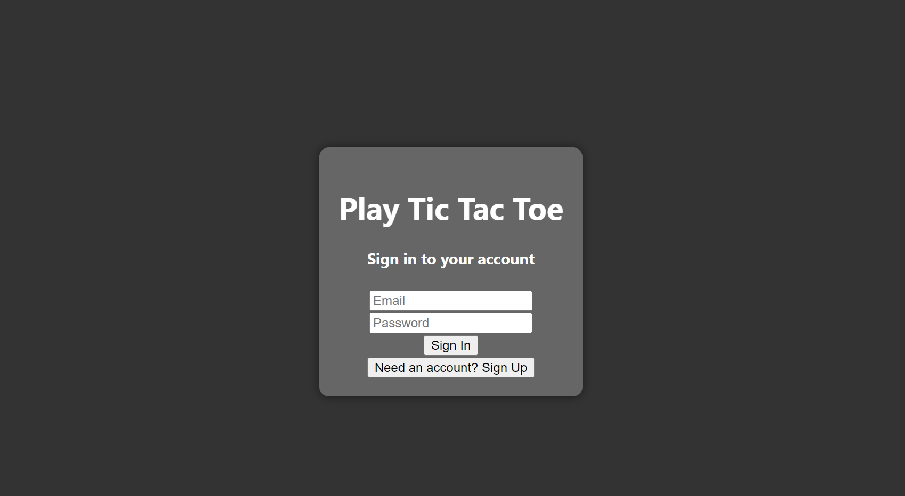
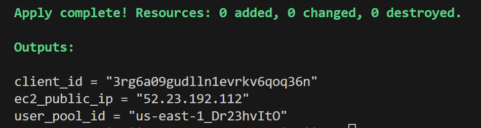
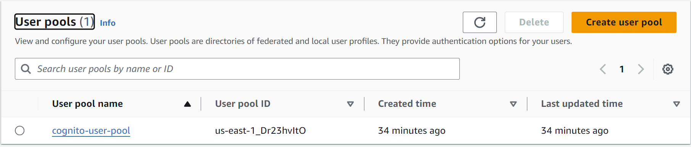
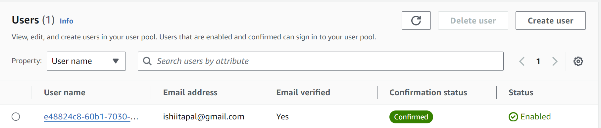

# README

## Configured AWS Services

This project sets up a full-stack application using various AWS services:

1. **AWS Cognito User Pool**:
   - **User Pool**: Manages user registration and authentication.
     - Name: `cognito-user-pool`
     - Username Attributes: `email`
     - Auto Verified Attributes: `email`
   - **User Pool Client**: Configures the user pool client settings.
     - Name: `cognito-user-pool-client`
     - Generate Secret: `false`
     - Explicit Auth Flows: `ALLOW_USER_PASSWORD_AUTH`, `ALLOW_REFRESH_TOKEN_AUTH`
     - Refresh Token Validity: `90`

2. **AWS VPC (Virtual Private Cloud)**:
   - **VPC**:
     - CIDR Block: `10.0.0.0/16`
     - Name: `my_vpc`
   - **Subnet**:
     - CIDR Block: `10.0.1.0/24`
     - VPC ID: `my_vpc`
     - Name: `my_subnet`
   - **Internet Gateway**:
     - VPC ID: `my_vpc`
     - Name: `my_igw`
   - **Route Table**:
     - VPC ID: `my_vpc`
     - Routes:
       - Destination CIDR Block: `0.0.0.0/0`
       - Gateway ID: `my_igw`
     - Name: `my_route_table`
   - **Route Table Association**:
     - Subnet ID: `my_subnet`
     - Route Table ID: `my_route_table`
     - Name: `my_subnet_association`
   - **Security Group**:
     - Name: `my_security_group`
     - Description: `Allow SSH, HTTP, and custom TicTacToe ports`
     - VPC ID: `my_vpc`
     - Ingress Rules:
       - Port: `22` (SSH), Protocol: `tcp`, Source: `0.0.0.0/0`
       - Port: `8080` (HTTP), Protocol: `tcp`, Source: `0.0.0.0/0`
       - Port: `8081`, Protocol: `tcp`, Source: `0.0.0.0/0`
     - Egress Rules:
       - All traffic allowed

3. **AWS EC2 (Elastic Compute Cloud)**:
   - **EC2 Instance**:
     - AMI ID: `ami-080e1f13689e07408`
     - Instance Type: `t2.small`
     - Key Name: `vockey`
     - Subnet ID: `my_subnet`
     - Security Group: `my_security_group`
     - Associate Public IP Address: `true`
     - User Data Script: Configures Docker, Docker Compose, JDK, Maven, and deploys the application.
     - Tags: 
       - Name: `Tic-tac-toe-Webserver3`

## Reflection

### 1. What did you learn?

Through this project, I learned how to use Terraform to automate the setup of AWS services. I gained hands-on experience with AWS Cognito for user authentication and understood the importance of VPCs in creating isolated network environments. Additionally, I learned to automate the installation and configuration of software on an EC2 instance using user data scripts.

### 2. What obstacles did you overcome?

One significant obstacle I overcame was configuring the user data script for the EC2 instance. Initially, the script failed due to syntax errors and missing dependencies. By reviewing the error logs and updating the script incrementally, I was able to ensure all necessary software was installed and configured correctly. This process involved troubleshooting issues with Docker installation and the replacement of placeholder values with dynamic data from AWS metadata.

### 3. What helped most in overcoming obstacles?

Consistently referring to the official documentation for Terraform and AWS services was invaluable. These resources provided accurate and up-to-date information on how to properly configure and troubleshoot various services. Engaging with the community through forums and discussions also provided practical insights and solutions.

### 4. Was there something that surprised you?

I was pleasantly surprised by how powerful and flexible Terraform is in managing infrastructure as code. The ability to define, provision, and manage AWS resources with such precision and automation exceeded my expectations. Additionally, the seamless integration between Terraform and AWS services made the deployment process straightforward and efficient.

## Application running

### account-confirmation.png

### email-verification.png

### Game-Running.png

### message-confirmation.png

### Screenshot 2024-06-20 141853.png

### SignIn.png

### SignUp.png

### Terraform-Apply.png

### user-pool.png

### users.png

