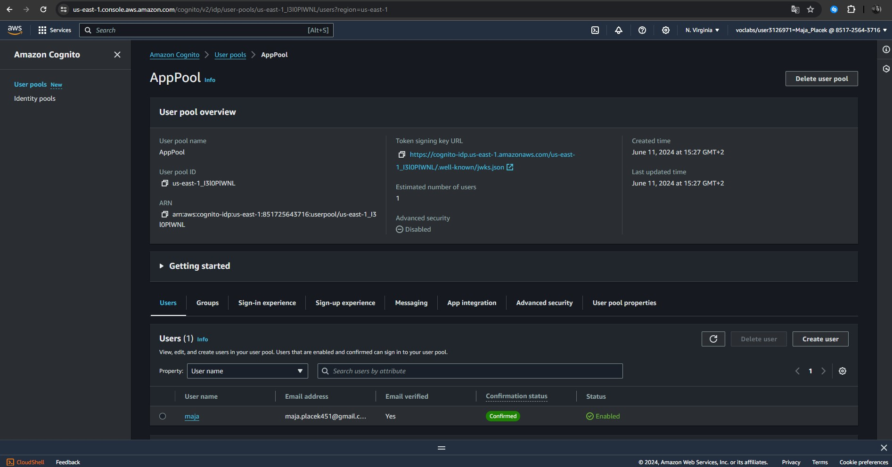
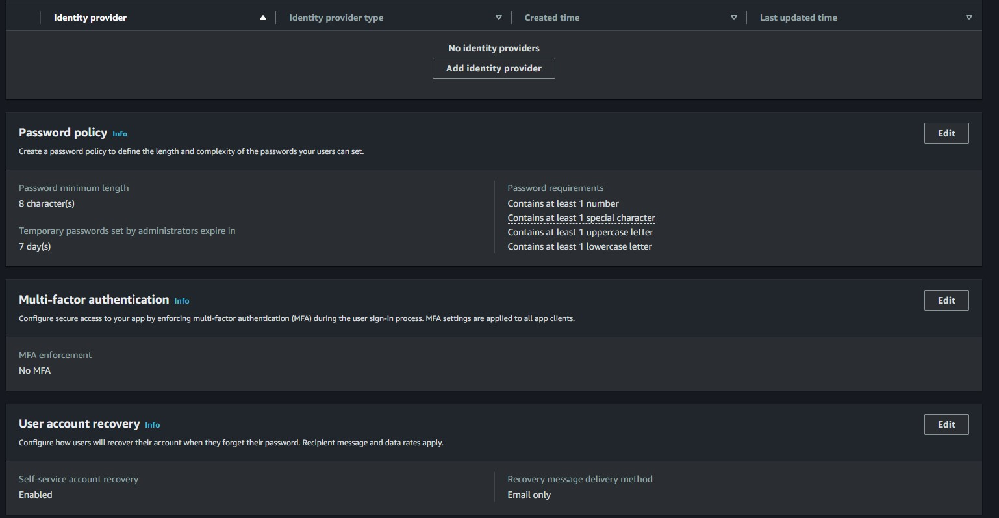
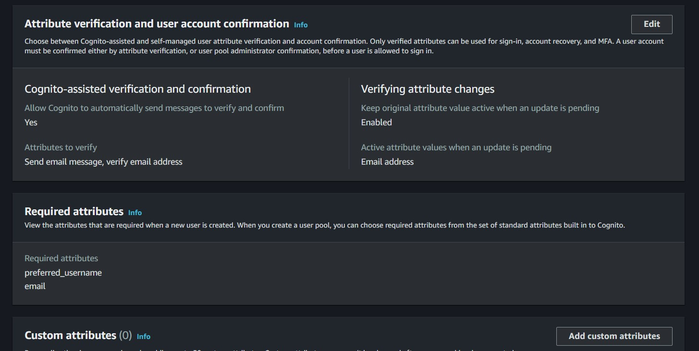
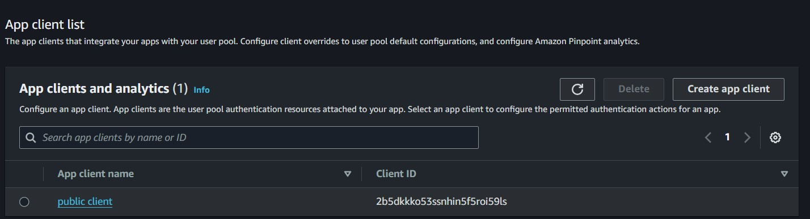
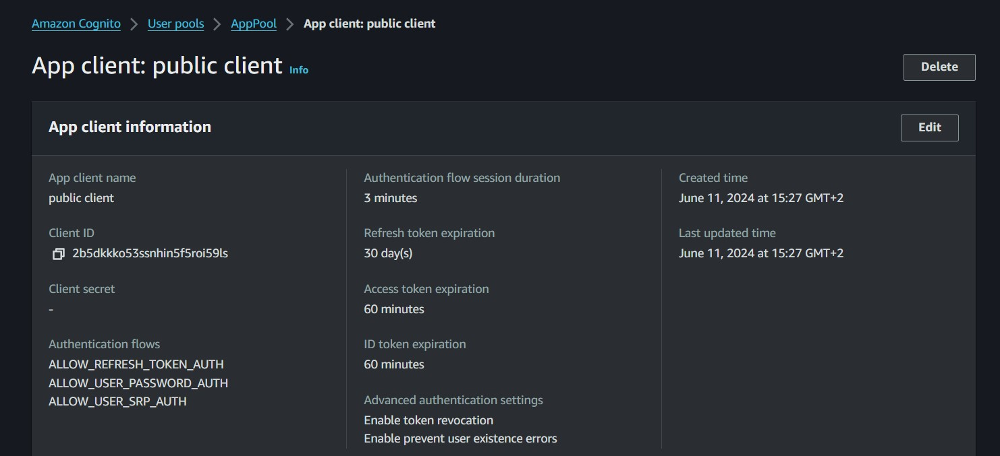
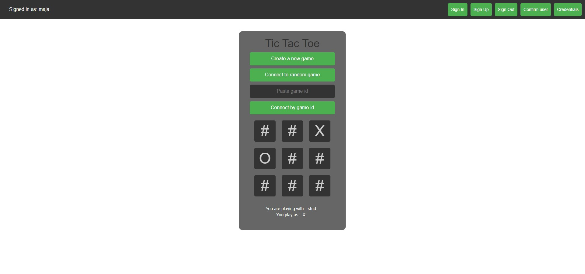
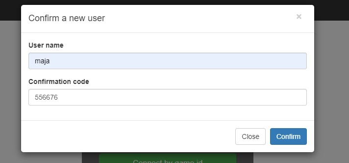
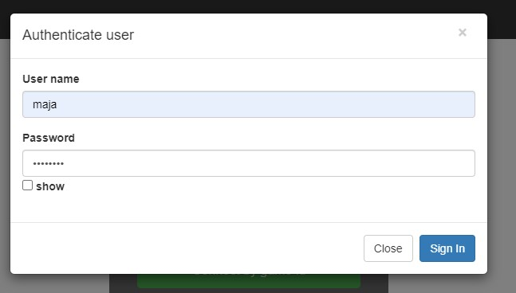

# Ishiita - Cognito, TicTacToe report

- Course: *Cloud programming*
- Group: Thursday 3:15pm
- Date: 13.06.2024

## Environment architecture

### Provider Configuration
The architecture begins with configuring the AWS provider for the region `us-east-1`, which sets the geographic location for the AWS resources.

### Cognito User Pool
The AWS Cognito User Pool, named `AppPool`, is configured to manage user authentication and attributes. Deletion protection is enabled to prevent accidental deletion of the user pool.

#### Password Policy
A stringent password policy is set to enhance security. It requires passwords to have a minimum length of 8 characters and include uppercase letters, lowercase letters, numbers, and symbols. Additionally, temporary passwords are valid for 7 days, ensuring users update them promptly.

#### Schema Attributes
The user pool schema defines the attributes stored for each user:

- **sub**: A unique identifier for the user. It is required and immutable, ensuring a consistent and unique reference for each user.
- **email**: The user's email address, which is required and mutable. This is essential for communication and account recovery.
- **email_verified**: A Boolean attribute indicating whether the user's email address has been verified. This helps maintain the integrity and validity of user emails.
- **preferred_username**: A required attribute that users can set as their display name or handle, enhancing the user experience by allowing personalized usernames.

#### Auto Verified Attributes
The user pool automatically verifies user email addresses upon registration. This ensures that users' email addresses are legitimate, reducing the risk of spam accounts.

#### Verification Message Template
The default email verification option is configured to use `CONFIRM_WITH_CODE`, which sends a confirmation code to the user’s email. This is a common and user-friendly method for email verification.

#### User Attribute Update Settings
To ensure security, the user pool requires re-verification of the email address before it can be updated. This prevents unauthorized changes to important account information.

#### MFA Configuration
Multi-Factor Authentication (MFA) is disabled in this setup. However, MFA can be enabled in the future to add an extra layer of security.

#### Email Configuration
The user pool uses the default Cognito email sending account to manage email communications. This simplifies the setup and leverages AWS’s built-in capabilities.

#### Admin Create User Configuration
User self-registration is allowed. The configuration includes templates for email and SMS messages sent when an admin creates a user, ensuring users receive necessary information to access their accounts.

#### Username Configuration
Usernames are configured to be case-insensitive. This improves usability by allowing users to enter their usernames without worrying about case sensitivity.

#### Account Recovery Setting
Verified email is prioritized for account recovery. This ensures users can regain access securely if they forget their passwords or need to recover their accounts.

### Cognito User Pool Client
The AWS Cognito User Pool Client, named `public client`, is configured to facilitate interactions between the user pool and applications.

#### Token Validity
The client configuration sets the validity periods for different types of tokens:
- Refresh tokens are valid for 30 days.
- Access tokens are valid for 60 minutes.
- ID tokens are valid for 60 minutes.
This ensures sessions are secure and tokens are refreshed periodically.

#### Read and Write Attributes
The client is allowed to read and write specific user attributes:
- Read attributes: `email`, `email_verified`, `preferred_username`.
- Write attributes: `email`, `preferred_username`.
This controls what information the application can access and modify, maintaining security and privacy.

#### Explicit Auth Flows
The client supports several authentication flows:
- Refresh token authentication
- User password authentication
- Secure Remote Password (SRP) authentication
These flows provide flexibility in how users can authenticate, accommodating various use cases and security requirements.

#### Additional Configurations
- OAuth flows are not enabled for this client.
- User existence errors are prevented to enhance security and avoid information leakage.
- Token revocation is enabled, allowing tokens to be invalidated if necessary.
- The session validity is set to 3 hours, balancing security and usability.

### Summary
This architecture leverages AWS Cognito to manage user authentication and authorization securely and efficiently. The Cognito User Pool provides a centralized directory for user management with robust security features, including strong password policies and email verification. The User Pool Client facilitates secure interactions between applications and the user pool, supporting multiple authentication flows and ensuring proper token management. This setup enhances the security posture of the application while providing a seamless and secure user experience.

## Preview

### Screenshots of configured AWS services
- App UserPool

- Sign in experience

- Sign up experience

- Public client

- Public client details

### Screenshots of your application running.
- Home page

- Sign up form

- Confirm user form

- Sign in form

## Reflections

- What did you learn?
  - I learned how to integrate AWS Cognito into an existing project, leveraging its user management and authentication capabilities. This included setting up a new User Pool, configuring policies, and creating App Clients to facilitate secure interactions between the frontend and backend. In the future I would like to explore further functionalities of Cognito.
- What obstacles did you overcome?
  - Passing the token to the backend: Ensuring that only authenticated users could access certain backend resources and functionalities was crucial. I used the amazon-cognito-identity-js library to handle the authentication flow and retrieve tokens. Understanding how to build a proper header to include these tokens in API requests was another challenge. This involved analyzing and implementing secure methods to pass the token and validate it on the server side.
  - Easy assignment in comparison to previous ones: Despite being relatively easier, it was essential to ensure all configurations and integrations were done correctly, which still required careful attention to detail.
- What did you help most in overcoming obstacles?
  -  internet resources
    - https://www.youtube.com/watch?v=QKxTGcJHar0 This video provided a step-by-step guide on setting up and integrating AWS Cognito with a .NET web application.
    - https://www.npmjs.com/package/amazon-cognito-identity-js The documentation for the amazon-cognito-identity-js library was invaluable for understanding how to implement the authentication flow and manage tokens effectively.
- Was that something that surprised you?
  - Easy integration into both .NET and JavaScript: I was pleasantly surprised by how seamlessly AWS Cognito integrated with both .NET and JavaScript environments. This flexibility allowed me to implement a consistent authentication mechanism across different parts of the application.
  - Extensive security features offered by AWS Cognito: AWS Cognito's extensive security features, such as built-in MFA, password policies, and automated email verification, exceeded my expectations. These features may significantly enhance the security posture of the application without requiring extensive custom development.
